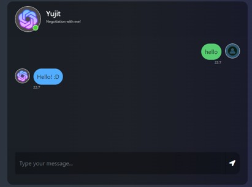
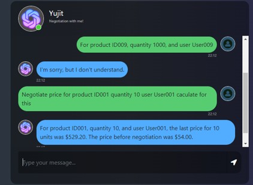

# 🤖 Yujit – AI-Powered Negotiation Assistant


> An intelligent AI-powered negotiation chatbot that understands customer intent, analyzes negotiation patterns, and dynamically negotiates product prices using Natural Language Processing and Machine Learning.

---

# 🌟 Project Overview

Negotiation is a critical aspect of business, e-commerce, procurement, and customer interactions. Traditional systems use fixed pricing models that cannot adapt to user behavior or negotiation strategies.

**Yujit** was developed to solve this challenge by introducing an AI-powered virtual negotiator capable of:

✅ Understanding customer messages using BERT NLP

✅ Identifying negotiation intent

✅ Calculating personalized discount offers

✅ Maintaining business profitability

✅ Simulating human-like negotiation conversations

Instead of offering static discounts, Yujit intelligently determines the best possible offer while ensuring that pricing never falls below a predefined minimum threshold.

---

# 🎯 Problem Statement

In online marketplaces and customer service environments:

* Manual negotiation consumes time and resources.
* Fixed discount systems lack flexibility.
* Businesses struggle to balance customer satisfaction and profit margins.
* Customers expect personalized interactions.

Yujit bridges this gap through AI-driven conversational negotiation.

---

# 🚀 Key Features

### 🤖 AI-Powered Intent Recognition

Uses a BERT-based Natural Language Processing model to understand customer messages and negotiation intent.

### 💬 Smart Conversational Agent

Engages users in natural conversations and responds dynamically based on negotiation context.

### 💰 Dynamic Price Negotiation

Calculates personalized offers based on:

* Initial Product Price
* Customer Behavior
* Negotiation Attempts
* Product Constraints
* Business Rules

### 🧠 Machine Learning Driven

Learns negotiation patterns from historical datasets and customer interactions.

### 📊 Data-Based Decision Making

Negotiation outcomes are generated using trained machine learning models and pricing formulas.

### 🔒 Business Protection

Ensures negotiated prices never fall below predefined minimum thresholds.

### ⚡ Real-Time Response System

Provides instant negotiation feedback and pricing suggestions.

---

# 🏗️ System Architecture

```text
User Message
      │
      ▼
Intent Detection (BERT Model)
      │
      ▼
Negotiation Logic Engine
      │
      ├── Product Constraints
      ├── Pricing Rules
      ├── Customer Factors
      │
      ▼
Offer Calculation Module
      │
      ▼
AI Chat Response
      │
      ▼
Final Negotiated Price
```

---

# 🛠️ Technology Stack

## Programming Language

* Python 3.10

## Machine Learning

* BERT (Bidirectional Encoder Representations from Transformers)

## Natural Language Processing

* Intent Classification
* Text Understanding
* Context Recognition

## Data Processing

* Pandas
* NumPy

## Web Scraping & Data Collection

* Beautiful Soup

## Dataset Management

* CSV-based Training Data
* JSON Intent Dataset

---

# 📂 Project Structure

```bash
Yujit-Bot/
│
├── main.py
├── model_bert.py
├── intents_negotiation.json
├── bot_responses_negotiations.py
├── negociation_products_operations.py
├── nego.csv
│
├── README.md
└── assets/
    └── screenshots/
```

---

# ⚙️ How It Works

### Step 1 – User Initiates Negotiation

Example:

"Can you reduce the price?"

### Step 2 – BERT Analyzes Intent

The NLP model classifies the user's intention:

* Bargaining
* Discount Request
* Product Inquiry
* Acceptance
* Rejection

### Step 3 – Negotiation Engine Processes Request

Business rules and negotiation formulas are applied.

### Step 4 – Dynamic Offer Generated

Example:

Original Price: ₹10,000

AI Offer: ₹9,200

### Step 5 – Continue Negotiation

The chatbot intelligently responds until:

* Agreement is reached
* Minimum price threshold is reached
* Negotiation ends

---

# 📈 AI Negotiation Workflow

```text
Customer Request
        │
        ▼
 Intent Classification
        │
        ▼
 Negotiation Strategy
        │
        ▼
 Discount Calculation
        │
        ▼
 Counter Offer Generation
        │
        ▼
 Customer Response
        │
        ▼
 Final Agreement
```

---

# 📸 Screenshots

<h2 align="center">🏠 Home Interface</h2>

<p align="center">
  
</p>

<h2 align="center">💬 Negotiation Chat Window</h2>

<p align="center">
  
</p>

---

# 🚀 Installation

Clone the repository:

```bash
git clone https://github.com/Aayushipandey54/Yujit-Bot.git
```

Move to project directory:

```bash
cd Yujit-Bot
```

Install dependencies:

```bash
pip install -r requirements.txt
```

---

# ▶️ Usage

## Train Model

```bash
python main.py --mode train
```

## Test Model

```bash
python main.py --mode test
```

---

# 📊 Sample Negotiation

### Customer

> Can you give me a discount?

### Yujit

> I can offer a 5% discount on this product.

### Customer

> That's still expensive.

### Yujit

> Based on your request, I can reduce the price further to ₹8,900.

### Customer

> Deal!

### Yujit

> Great! The final negotiated price is ₹8,900.

---

# 🎓 Academic Information

### Project Duration

January 2024 – October 2024

### Institution

Government Polytechnic Mumbai

### Domain

Artificial Intelligence & Machine Learning

### Skills Applied

* Natural Language Processing
* BERT Model Training
* Pattern Recognition
* Machine Learning
* Conversational AI
* Data Analysis
* Beautiful Soup
* Python Development

---

# 🔮 Future Enhancements

* Voice-Based Negotiation
* Multi-Language Support
* Deep Reinforcement Learning Negotiation Agents
* Sentiment Analysis Integration
* Real-Time E-Commerce Integration
* Dashboard Analytics
* Customer Behavior Prediction
* Generative AI Negotiation Strategies

---

# 🏆 Project Impact

Yujit demonstrates how Artificial Intelligence can automate one of the most complex human activities—negotiation.

The project combines NLP, Machine Learning, and Business Intelligence to create a practical AI solution capable of improving customer engagement while protecting business profitability.

---

# 👩‍💻 Developer

### Aayushi Pandey

AI & Machine Learning Engineering

GitHub: https://github.com/Aayushipandey54

---

⭐ If you found this project interesting, consider giving it a star and supporting future AI innovations!
